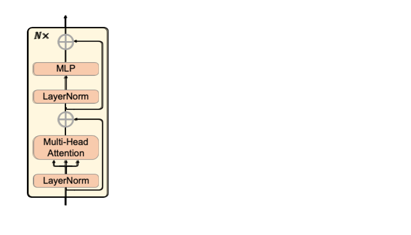

<div align="center">

## [NeurIPS 2022] AdaptFormer: Adapting Vision Transformers for Scalable Visual Recognition

### [Project Page](http://www.shoufachen.com/adaptformer-page/) |  [arXiv](https://arxiv.org/abs/2205.13535)


</div>


This is a PyTorch implementation of the paper [AdaptFormer: Adapting Vision Transformers for Scalable Visual Recognition](https://arxiv.org/abs/2205.13535).

[Shoufa Chen](https://www.shoufachen.com/)<sup>1</sup>\*,
[Chongjian Ge](https://chongjiange.github.io/)<sup>1</sup>\*,
[Zhan Tong](https://scholar.google.com/citations?user=6FsgWBMAAAAJ)<sup>2</sup>,
[Jiangliu Wang](https://laura-wang.github.io/)<sup>2,3</sup>,
[Yibing Song](https://ybsong00.github.io/)<sup>2</sup>,
[Jue Wang](http://juewang725.github.io/)<sup>2</sup>,
[Ping Luo](http://luoping.me/)<sup>1</sup> <br>
<sup>1</sup>The University of Hong Kong, <sup>2</sup>Tencent AI Lab, <sup>3</sup>The Chinese University of Hong Kong  
\*denotes equal contribution

### Catalog

- [x] Video code
- [x] Image code

### Usage

#### Install
* Tesla V100 (32G): CUDA 10.1 + PyTorch 1.6.0 + torchvision 0.7.0
* timm 0.4.8
* einops
* easydict

#### Data Preparation
See [DATASET.md](DATASET.md).

#### Training
Start
```bash
# video
OMP_NUM_THREADS=1 python3 -m torch.distributed.launch \
    --nproc_per_node=8 --nnodes=8 \
    --node_rank=$1 --master_addr=$2 --master_port=22234 \
    --use_env main_video.py \
    --finetune /path/to/pre_trained/checkpoints \
    --output_dir /path/to/output \
    --batch_size 16 --epochs 90 --blr 0.1 --weight_decay 0.0 --dist_eval \
    --data_path /path/to/SSV2 --data_set SSV2 \
    --ffn_adapt
```
on each of 8 nodes. `--master_addr` is set as the ip of the node 0. and `--node_rank` is 0, 1, ..., 7 for each node.

```bash
# image
python3 -m torch.distributed.launch --nproc_per_node=8 --use_env main_image.py \
    --batch_size 128 --cls_token \
    --finetune /path/to/pre_trained/mae_pretrain_vit_b.pth \
    --dist_eval --data_path /path/to/data \
    --output_dir /path/to/output  \
    --drop_path 0.0  --blr 0.1 \
    --dataset cifar100 --ffn_adapt
```

To obtain the pre-trained checkpoint, see [PRETRAIN.md](PRETRAIN.md).
### Acknowledgement

The project is based on [MAE](https://github.com/facebookresearch/mae), [VideoMAE](https://github.com/MCG-NJU/VideoMAE), [timm](https://github.com/rwightman/pytorch-image-models), and [MAM](https://github.com/jxhe/unify-parameter-efficient-tuning).
Thanks for their awesome works.

### Citation
```
@article{chen2022adaptformer,
      title={AdaptFormer: Adapting Vision Transformers for Scalable Visual Recognition},
      author={Chen, Shoufa and Ge, Chongjian and Tong, Zhan and Wang, Jiangliu and Song, Yibing and Wang, Jue and Luo, Ping},
      journal={arXiv preprint arXiv:2205.13535},
      year={2022}
}
```

### License

This project is under the MIT license. See [LICENSE](LICENSE) for details.
